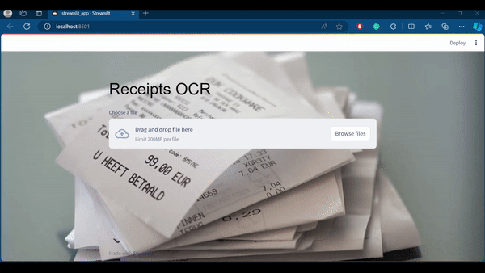

# Driving Scene Segmentation
 <br>

## Performing OCR on Receipts.

In this project, I have implemented an OCR pipeline using YOLO for text detection and a custom CRNN model for text recognition.

# Approach

## DataSet
I have used dataset of invoices and receipts from Hugging Face. Dataset [link](https://huggingface.co/datasets/mychen76/invoices-and-receipts_ocr_v1?row=1)

## Model
For text detection, I have used YOLO v8 model and for text detection and CRNN model consisting 7 layers of CNN with BatchNorm and MaxPool, and a 2 layer lstm, used for text recognition.

## Training
I have approached the text recognition problem at character level. I have used CTC loss for training the text recognition model and AdamW optimizer with 1e-3 learning rate and 0.03 decay rate.

## Result
- For Text Detection, YOLO v8: mAP50 = 99.4% and mAP50-95 = 81.1%
- For Text Recognition: CTC Train loss = 0.253, Valid Loss = 0.108 and Test Loss = 0.225
# To run the project

```bash
git clone https://github.com/mohan-gupta/driving-scene-segmentation.git  # clone
cd driving-scene-segmentation
pip install -r requirements.txt  # install
cd app
streamlit run streamlit_app.py  # for running the streamlit app
OR
uvicorn main:app # for running the fastapi webapp
```